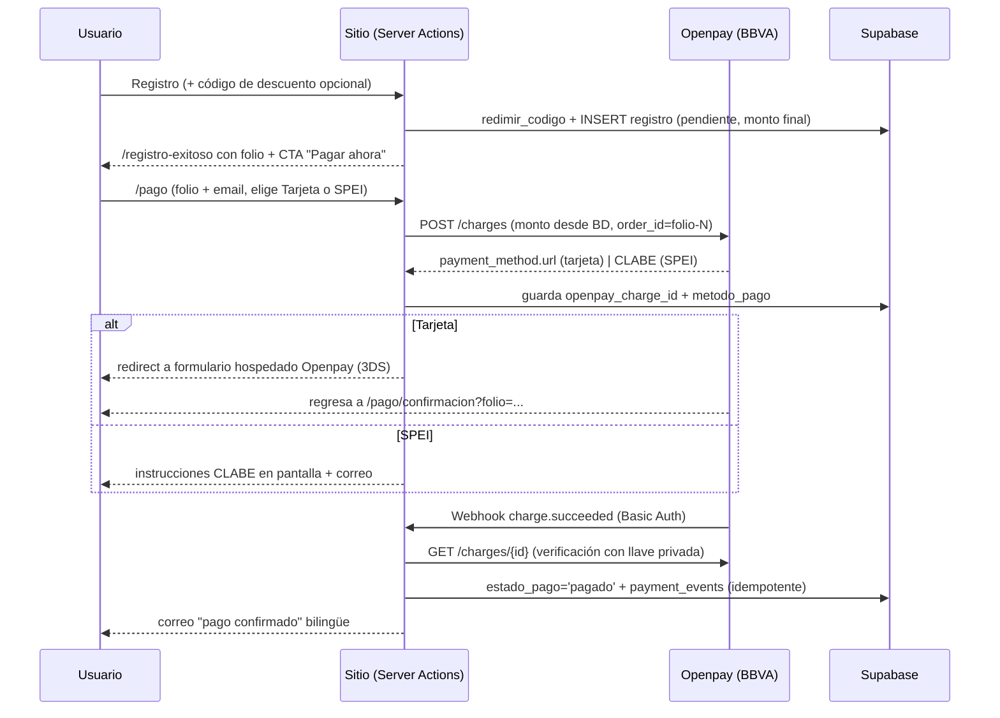

# Plan: Pagos en línea con Openpay (BBVA) + Códigos de descuento

> **Estado:** Plan de implementación — decisiones de negocio confirmadas (2026-07-16):
> métodos de pago **tarjeta + SPEI**; los precios anunciados **ya incluyen IVA** (se cobra `monto_mxn` tal cual);
> cuenta Openpay/BBVA aún **por crear** (ver §10, Fase 0).
> **Fecha:** 2026-07-16
> **Alcance:** Cobro en línea de los accesos (tarjeta y SPEI) vía Openpay de BBVA, confirmación automática de pago por webhook, y sistema de códigos de descuento con administración desde `/admin`.

---

## 1. Resumen ejecutivo

Hoy el flujo es: registro → folio → un representante contacta en 24–48 hrs → pago por transferencia manual → un admin marca "pagado" en `/admin/registros`.

El plan agrega un **paso de pago en línea inmediato** después del registro, manteniendo la transferencia manual como respaldo:

1. El asistente se registra (flujo actual intacto) y opcionalmente aplica un **código de descuento** en el formulario.
2. En `/registro-exitoso` aparece un CTA **"Pagar ahora"** → página de pago con dos métodos:
   - **Tarjeta** (crédito/débito) vía *cargo con redirección* de Openpay (formulario hospedado por Openpay, con 3D Secure).
   - **SPEI** (transferencia): Openpay genera una CLABE única de BBVA; se muestran las instrucciones y se envían por correo.
3. Openpay notifica el resultado por **webhook** → el registro pasa a `estado_pago = 'pagado'` automáticamente y se envía el correo de confirmación de pago.
4. Los organizadores administran códigos de descuento (crear, desactivar, ver usos) en `/admin/codigos`.

**Decisión técnica central:** integrar contra la **REST API de Openpay directamente** (cliente propio en `lib/openpay.ts`) y **no** usar el SDK `openpay` de npm. Ver §2.2.

---

## 2. Investigación de la librería Openpay

### 2.1 Plataforma

- Openpay es la pasarela de pagos de BBVA México. API REST con autenticación **HTTP Basic**: la llave privada como usuario y contraseña vacía (`sk_xxx:` en base64).
- **URLs base:**
  - Sandbox: `https://sandbox-api.openpay.mx/v1/{MERCHANT_ID}`
  - Producción: `https://api.openpay.mx/v1/{MERCHANT_ID}`
- **Credenciales** (dashboard de Openpay, juegos separados para sandbox y producción):
  - `MERCHANT_ID` (no es secreto)
  - Llave pública `pk_…` (segura para el navegador; solo se necesita si usamos Openpay.js)
  - Llave privada `sk_…` (**solo servidor**, misma disciplina que `SUPABASE_SERVICE_ROLE_KEY`)
- Montos en **pesos con hasta 2 decimales** (no centavos). Moneda `MXN`.

### 2.2 SDK oficial de Node — descartado

El paquete npm `openpay` está efectivamente abandonado:

| Aspecto | Estado |
|---|---|
| Última versión | `1.0.5` — **febrero 2020** |
| Dependencias | `request` (deprecado desde 2020) y `underscore` 1.5 (2013) |
| TypeScript | Sin tipos |
| Estilo | Callbacks `(error, body, response)`, sin Promises |

Usarlo metería una dependencia sin mantenimiento y con deuda de seguridad en la ruta más sensible del sitio. La API REST es pequeña (3–4 endpoints nos bastan), así que la recomendación es un **cliente propio tipado con `fetch`** (~120 líneas), consistente con el estilo del repo (como `lib/rate-limit.ts` o `lib/email.ts`).

### 2.3 Operaciones del API que usaremos

**Cargo con tarjeta — redirección (hospedado por Openpay)** — `POST /v1/{merchant}/charges`

```json
{
  "method": "card",
  "amount": 2500.00,
  "currency": "MXN",
  "description": "SC Security Summit 2026 — Acceso General",
  "order_id": "SCSS2026-XXXXX-XXXX-1",
  "confirm": "false",
  "send_email": "false",
  "redirect_url": "https://scsecuritysummit.com/pago/confirmacion?folio=...",
  "use_3d_secure": "true",
  "customer": { "name": "...", "last_name": "...", "email": "...", "phone_number": "..." }
}
```

La respuesta llega con `status: "charge_pending"` y `payment_method.url`: la URL del formulario de pago hospedado por Openpay a donde redirigimos al usuario. Openpay captura los datos de tarjeta (nosotros nunca los tocamos → carga PCI mínima), aplica 3D Secure y regresa al usuario a `redirect_url`.

**Cargo SPEI** — mismo endpoint con `"method": "bank_account"`. Respuesta `status: "in_progress"` con `payment_method`: `{ type: "bank_transfer", bank: "BBVA Bancomer", clabe, agreement, name }`. El usuario transfiere desde su banca y el webhook confirma. Acepta `due_date` (vigencia de la referencia).

**Consultar un cargo** — `GET /v1/{merchant}/charges/{transaction_id}` → se usa para verificar el estado real antes de marcar pagado (nunca confiar solo en el payload del webhook ni en query params).

**Reembolso** — `POST /v1/{merchant}/charges/{id}/refund` (solo tarjeta). Fase 2; el manejo inicial de reembolsos puede ser manual desde el dashboard de Openpay.

**Opcional (tiendas/paynet):** `"method": "store"` genera referencia + `barcode_url` para pagar en tiendas de conveniencia. Lo dejo fuera de la Fase 1 (agrega comisiones y soporte operativo), pero el diseño lo permite después.

### 2.4 Webhooks

- Se crean en el dashboard o vía `POST /v1/{merchant}/webhooks` con `{ url, user, password, event_types }`. Openpay envía las notificaciones con **Basic Auth** usando ese `user`/`password` → nuestra verificación de autenticidad.
- Al crear el webhook, Openpay envía un evento `verification` con un `verification_code` que hay que confirmar (una vez, en el setup).
- **Eventos relevantes:** `charge.succeeded` (pago aplicado — el que dispara "pagado"), `charge.created` (cargo agendado, p. ej. SPEI emitido), `charge.failed`, `charge.cancelled`, `charge.refunded`, `chargeback.created/accepted/rejected`.
- Payload: `{ type, event_date, transaction: { id, order_id, amount, status, method, ... } }`.

### 2.5 Openpay.js (solo si en el futuro queremos formulario de tarjeta propio)

- Scripts: `https://openpay.s3.amazonaws.com/openpay.v1.min.js` + `openpay-data.v1.min.js` (antifraude).
- `OpenPay.setId()`, `OpenPay.setApiKey(pk_…)`, `OpenPay.setSandboxMode(true)`, `OpenPay.deviceData.setup()` → `device_session_id`, `OpenPay.token.create()` → token que el servidor usa como `source_id`.
- Implicaciones: agregar dominios de Openpay al CSP de `middleware.ts`, manejar el formulario de tarjeta en nuestra página (PCI SAQ A-EP) y usar `device_session_id` obligatorio.
- **Recomendación: no en Fase 1.** El cargo con redirección cubre lo mismo con una fracción del riesgo y del código. Si después se quiere UX de pago embebida, se agrega como Fase 2 sin rehacer nada del backend.

### 2.6 Sandbox y pruebas

- Dashboard sandbox con tarjetas de prueba (p. ej. `4111 1111 1111 1111` aprobada, `4222 2222 2222 2220` rechazada); SPEI se simula desde el dashboard.
- El webhook necesita URL pública → en Vercel los *preview deployments* sirven; localmente, túnel o disparo manual del handler.

---

## 3. Decisiones de arquitectura

| Decisión | Recomendación | Razón |
|---|---|---|
| SDK vs REST | Cliente REST propio (`lib/openpay.ts`) | SDK abandonado (§2.2); tipado; testeable |
| Tarjeta | Cargo con redirección (hospedado) | Sin datos de tarjeta en nuestro dominio; 3DS incluido; cero cambios de CSP |
| SPEI | Sí, Fase 1 ✅ **confirmado** | Público B2B mexicano paga mucho por transferencia; sustituye la CLABE "manual" actual |
| Tarjeta | Sí, Fase 1 ✅ **confirmado** | Cargo con redirección (fila anterior) |
| Tiendas (paynet) | Descartado por ahora (Fase 5 opcional) | Comisión + operación extra; no crítico para B2B |
| Confirmación | Webhook + re-consulta del cargo | El webhook avisa; el `GET /charges/{id}` con llave privada es la fuente de verdad |
| Flujo manual actual | Se conserva como respaldo | `metodo_pago = 'transferencia_manual'` sigue funcionando; feature flag para apagar Openpay sin romper nada |
| IVA | ✅ **Decidido: los precios anunciados YA incluyen IVA** | Se cobra `monto_mxn` tal cual, sin multiplicar por 1.16. **Implica corregir copys existentes que dicen lo contrario:** `taxNote` en `lib/content.ts` ("* Más I.V.A." / "* Plus VAT" → "IVA incluido" / "VAT included") y `amountSuffix` en `/registro-exitoso` ("MXN + IVA" → "MXN · IVA incluido"). Para CFDI, el subtotal se desglosa desde el precio final: `subtotal = monto / 1.16` |

**Compatibilidad con el stack:** todo corre en Server Actions / Route Handlers de Next 15 con runtime Node (el webhook se declara `export const runtime = "nodejs"`). Sin dependencias nuevas de npm.

---

## 4. Modelo de datos — migración `011_openpay_descuentos.sql`

### 4.1 Tabla `codigos_descuento`

```sql
CREATE TABLE public.codigos_descuento (
  id              UUID PRIMARY KEY DEFAULT gen_random_uuid(),
  codigo          TEXT NOT NULL UNIQUE,          -- normalizado a MAYÚSCULAS, ^[A-Z0-9_-]{4,32}$
  descripcion     TEXT,
  tipo_descuento  TEXT NOT NULL CHECK (tipo_descuento IN ('porcentaje', 'monto_fijo')),
  valor           NUMERIC(10,2) NOT NULL CHECK (valor > 0), -- % (1–100) o MXN
  aplica_a        TEXT[] DEFAULT NULL,           -- NULL = todos los tipos; o subconjunto de {estudiante,general,vip}
  max_usos        INTEGER DEFAULT NULL,          -- NULL = ilimitado
  usos            INTEGER NOT NULL DEFAULT 0,
  valido_desde    TIMESTAMPTZ NOT NULL DEFAULT now(),
  valido_hasta    TIMESTAMPTZ DEFAULT NULL,      -- NULL = sin caducidad
  activo          BOOLEAN NOT NULL DEFAULT true,
  created_by      TEXT,                          -- email del admin que lo creó
  created_at      TIMESTAMPTZ NOT NULL DEFAULT now(),
  updated_at      TIMESTAMPTZ NOT NULL DEFAULT now()
);
-- + RLS habilitado, REVOKE a anon/authenticated y política de denegación explícita,
--   mismo patrón que 009_email_events.sql. Solo service_role opera la tabla.
```

**Redención atómica (sin condiciones de carrera sobre `max_usos`):**

```sql
UPDATE codigos_descuento
   SET usos = usos + 1
 WHERE codigo = $1 AND activo
   AND now() >= valido_desde AND (valido_hasta IS NULL OR now() <= valido_hasta)
   AND (max_usos IS NULL OR usos < max_usos)
   AND (aplica_a IS NULL OR $2 = ANY(aplica_a))
RETURNING tipo_descuento, valor;
```

Si regresa fila → código válido y consumido; si no → mensaje neutro. Si el INSERT del registro falla después, se ejecuta una compensación (`usos = usos - 1`). Expuesto como función SQL `redimir_codigo(p_codigo, p_tipo_acceso)` con `SECURITY DEFINER` y `EXECUTE` solo para `service_role` (patrón de `007_capacity_trigger.sql`).

### 4.2 Cambios en `registros`

```sql
ALTER TABLE public.registros
  ADD COLUMN IF NOT EXISTS codigo_descuento     TEXT,             -- código aplicado (denormalizado, para CSV/admin)
  ADD COLUMN IF NOT EXISTS descuento_mxn        INTEGER NOT NULL DEFAULT 0,
  ADD COLUMN IF NOT EXISTS openpay_charge_id    TEXT,             -- último cargo creado
  ADD COLUMN IF NOT EXISTS openpay_order_id     TEXT,             -- order_id enviado a Openpay
  ADD COLUMN IF NOT EXISTS pago_intentos        INTEGER NOT NULL DEFAULT 0;
```

- **Reemplazar `registros_monto_valido`** (hoy exige el precio exacto por tier, incompatible con descuentos):

```sql
ALTER TABLE public.registros DROP CONSTRAINT IF EXISTS registros_monto_valido;
ALTER TABLE public.registros ADD CONSTRAINT registros_monto_valido CHECK (
  monto_mxn >= 0 AND descuento_mxn >= 0 AND
  ((tipo_acceso = 'estudiante' AND monto_mxn + descuento_mxn = 850)  OR
   (tipo_acceso = 'general'    AND monto_mxn + descuento_mxn = 2500) OR
   (tipo_acceso = 'vip'        AND monto_mxn + descuento_mxn = 4800))
);
```

Así `monto_mxn` sigue siendo **lo que se cobra** y la suma con el descuento debe cuadrar con el precio de lista — la protección de integridad se conserva.

- **Extender `metodo_pago`**: el CHECK actual (migración 008) ya contempla `('spei','tarjeta','oxxo','transferencia_manual')`; se agrega `'cortesia'` (descuento del 100 %). Nota: la migración `20260505_enterprise_v1.sql` dejó columnas `conekta_*` de un intento anterior con Conekta; se dejan intactas (deprecadas) y las nuevas columnas usan el prefijo `openpay_`.

### 4.3 Tabla `payment_events` (auditoría, espejo de `email_events`)

```sql
CREATE TABLE public.payment_events (
  id             UUID PRIMARY KEY DEFAULT gen_random_uuid(),
  folio          TEXT,                 -- sin FK a propósito (igual que email_events)
  provider       TEXT NOT NULL DEFAULT 'openpay',
  event_type     TEXT NOT NULL,        -- charge.succeeded, charge.failed, webhook.rejected, charge.created…
  transaction_id TEXT,
  order_id       TEXT,
  amount         NUMERIC(10,2),
  status         TEXT,
  payload        JSONB NOT NULL DEFAULT '{}'::jsonb,  -- payload ya pasado por scrub de PII
  created_at     TIMESTAMPTZ NOT NULL DEFAULT now()
);
-- + índices por folio/transaction_id + RLS de denegación (mismo patrón 009)
```

Da trazabilidad completa (cada webhook recibido, aceptado o rechazado) y soporta la idempotencia.

---

## 5. Códigos de descuento — diseño

### 5.1 UX en el formulario de registro

- Nuevo campo opcional en `RegistroForm.tsx`, dentro de la sección de tipo de acceso: *"¿Tienes un código de descuento?"* con botón **Aplicar**.
- Al aplicar, un Server Action `validarCodigoDescuento(codigo, tipo_acceso)` hace **solo lectura** (sin consumir uso) y devuelve el precio con descuento para mostrarlo: `$2,500 → $2,000 MXN (COD-EJEMPLO −20 %)`.
- Anti-abuso (mismas capas que el resto del sitio): rate limit Upstash (`descuento:{ip}`, p. ej. 10 intentos/15 min), normalización a mayúsculas, regex `^[A-Z0-9_-]{4,32}$` antes de tocar la BD, y **mensaje neutro** («Código no válido o vencido») sin revelar si existe, está agotado o caducó — patrón de `/recuperar-folio`.

### 5.2 Redención en el servidor

En `create-lead.ts`, tras validar el payload y **antes** del INSERT:

1. Si viene código → `redimir_codigo(codigo, tipo_acceso)` (atómico, §4.1).
2. Cálculo en servidor (nunca del cliente): `descuento = round(porcentaje × precio / 100)` o `min(monto_fijo, precio)`; `monto_mxn = precio_lista − descuento`.
3. INSERT con `codigo_descuento`, `descuento_mxn` y el `monto_mxn` final. Si el INSERT falla → compensar el uso.
4. **Descuento del 100 %** → `estado_pago = 'pagado'`, `metodo_pago = 'cortesia'`, sin paso de pago; correo de confirmación normal.
5. El correo de confirmación y `/registro-exitoso` muestran precio de lista, descuento y total.

La lógica pura de cálculo vive en `lib/descuentos.ts` con tests unitarios (redondeos, topes, tipos de acceso permitidos, expiración).

### 5.3 Administración `/admin/codigos`

- Nueva página protegida por el guard existente de `/admin/*`: listado (código, tipo, valor, usos/max, vigencia, estado), creación y desactivación (no se borran: histórico), columna de ingresos descontados.
- Server Actions en `app/actions/admin.ts` siguiendo el patrón actual (verificación de sesión + `supabaseAdmin`), con `created_by` del admin autenticado.
- El CSV de `/admin/registros/export.csv` agrega columnas `codigo_descuento`, `descuento_mxn`, `metodo_pago`.

---

## 6. Flujo de pago end-to-end



### 6.1 Página de pago — `/pago`

- Acceso con **folio + email** (los dos deben coincidir con el registro) para no exponer PII con solo adivinar folios; rate limit por IP. Mismo patrón anti-enumeración de `/recuperar-folio`.
- Muestra: tipo de acceso, desglose (precio de lista − descuento, IVA si aplica, total) y los dos métodos.
- Si ya existe un cargo `in_progress` de tarjeta, **reutiliza** su `payment_method.url` en lugar de crear otro; si expiró/falló, crea uno nuevo con `order_id = {folio}-{n.º intento}` (el `order_id` es único global en Openpay, por eso el sufijo).
- Si `estado_pago = 'pagado'` → pantalla de "ya pagado". Enlace a `/pago` también desde el correo de confirmación y `/recuperar-folio`.

### 6.2 Confirmación — `/pago/confirmacion`

Al volver de 3DS, la página **consulta el cargo en Openpay del lado servidor** (jamás confía en query params) y muestra pagado / en proceso / rechazado (con reintento). El webhook sigue siendo quien persiste el estado; esta página solo lee.

### 6.3 Webhook — `app/api/webhooks/openpay/route.ts`

1. `runtime = "nodejs"`; responder `200` rápido.
2. **Basic Auth** contra `OPENPAY_WEBHOOK_USER/PASSWORD` con comparación de tiempo constante (`crypto.timingSafeEqual`); si falla → `401` + `payment_events` tipo `webhook.rejected`.
3. Evento `verification` → registrar el `verification_code` (Sentry + logs) para completar el alta una sola vez.
4. `charge.succeeded`: re-consultar `GET /charges/{transaction.id}` → validar `status = 'completed'`, `order_id` ↔ folio y **monto exacto** contra la BD → `UPDATE registros SET estado_pago='pagado' WHERE folio=... AND estado_pago='pendiente'` (idempotente: si ya estaba pagado, solo se audita) → correo de pago confirmado.
5. `charge.failed` / `charge.cancelled` / `charge.expired` → auditar; el registro sigue `pendiente` y puede reintentar.
6. `chargeback.*` → auditar + correo de alerta a `CONTACT_EMAIL`.
7. Todo payload pasa por `lib/sentry-scrub.ts` antes de persistirse/loggearse.

---

## 7. Cambios archivo por archivo

**Nuevos**

| Archivo | Contenido |
|---|---|
| `lib/openpay.ts` | Cliente REST tipado: `createRedirectCharge`, `createSpeiCharge`, `getCharge`; config sandbox/prod por env; errores tipados (`OpenpayError` con `error_code`) |
| `lib/openpay.test.ts` | Tests del cliente (payloads, auth header, manejo de errores) con fetch mockeado |
| `lib/descuentos.ts` + `.test.ts` | Cálculo puro de descuentos + validación de formato de código |
| `app/actions/descuento.ts` | Server Action de validación/preview (rate-limited) |
| `app/actions/pago.ts` | Server Actions: `iniciarPagoTarjeta`, `iniciarPagoSpei` (verifican folio+email, crean cargo, persisten) |
| `app/pago/page.tsx` + componentes | Página de pago (acceso folio+email, desglose, métodos) |
| `app/pago/confirmacion/page.tsx` | Resultado del pago (verificación server-side) |
| `app/api/webhooks/openpay/route.ts` | Webhook (§6.3) |
| `app/admin/codigos/…` | CRUD de códigos de descuento |
| `supabase/migrations/011_openpay_descuentos.sql` | Todo §4 |
| `server/use-cases/confirm-payment.ts` | Marca pagado + correo + auditoría (lo comparten webhook y, a futuro, el admin) |

**Modificados**

| Archivo | Cambio |
|---|---|
| `lib/schemas.ts` | Campo opcional `codigo_descuento` en `RegistroSchema` |
| `components/RegistroForm.tsx` | Campo de código + preview de precio |
| `server/use-cases/create-lead.ts` | Redención de código, `descuento_mxn`, cortesía 100 % |
| `app/registro-exitoso/page.tsx` | CTA "Pagar ahora" + desglose de descuento |
| `lib/email-templates.ts` / `lib/email.ts` | Plantillas nuevas: pago confirmado (ES/EN), instrucciones SPEI (ES/EN); enlace a `/pago` en la confirmación de registro |
| `app/actions/admin.ts`, `app/admin/registros/*` | Mostrar método de pago/cargo Openpay; CSV con columnas nuevas |
| `env.ts`, `scripts/check-env.mjs`, `.env.local.example`, `.env.example` | Variables nuevas (§8) |
| `lib/content.ts` | Copys del paso de pago (los 3 pasos de "¿Cómo funciona el pago?" cambian a pago en línea) + `taxNote` pasa de "* Más I.V.A." a "IVA incluido" (ES/EN) |
| `app/registro-exitoso/page.tsx` (copys) | `amountSuffix` "MXN + IVA" → "MXN · IVA incluido" (ES/EN) |
| `CLAUDE.md`, `docs/RUNBOOK.md` | Documentar flujo, webhook y runbook de incidencias de pago |

**Sin cambios:** `middleware.ts` (CSP) — el flujo con redirección no carga scripts de Openpay en nuestro dominio. Solo cambiaría si en Fase 2 se adopta Openpay.js.

---

## 8. Variables de entorno

```bash
# Openpay (server-only, como SUPABASE_SERVICE_ROLE_KEY)
OPENPAY_MERCHANT_ID=
OPENPAY_PRIVATE_KEY=            # sk_… JAMÁS con prefijo NEXT_PUBLIC_
OPENPAY_SANDBOX=1               # 1 = sandbox-api.openpay.mx, 0 = producción
OPENPAY_WEBHOOK_USER=           # Basic Auth del webhook
OPENPAY_WEBHOOK_PASSWORD=       # >= 32 chars aleatorios
OPENPAY_ENABLED=1               # feature flag: apagado ⇒ flujo manual actual
# (Fase 2, solo con Openpay.js) NEXT_PUBLIC_OPENPAY_MERCHANT_ID / NEXT_PUBLIC_OPENPAY_PUBLIC_KEY
```

Se agregan a `env.ts` (Zod, opcionales para no romper dev) y a la lista `RECOMMENDED` de `scripts/check-env.mjs` con el mismo tratamiento de placeholders que `RESEND_API_KEY`. Fail-safe: si `OPENPAY_ENABLED != 1` o faltan llaves, la página de pago no se ofrece y el sitio opera exactamente como hoy.

---

## 9. Pruebas

- **Unitarias (Vitest, junto al código como en el repo):** `lib/descuentos` (redondeo, topes, vigencia, tiers), `lib/openpay` (payloads/auth/errores con fetch mock), handler del webhook (auth inválida, evento duplicado → idempotencia, monto que no cuadra → rechazo), extensión de `RegistroSchema`.
- **Sandbox manual:** matriz tarjeta aprobada / rechazada / 3DS, SPEI simulado desde dashboard, código agotado en concurrencia (2 registros simultáneos con `max_usos=1` → solo uno gana).
- **E2E (`e2e/registro.spec.ts`):** registro con código válido/ inválido y llegada a `/pago` (la redirección a Openpay se stubbed).

---

## 10. Fases de implementación

| Fase | Entregable | Depende de |
|---|---|---|
| **0. Prerrequisitos (usuario)** | Cuenta Openpay/BBVA. ✅ Decisiones ya tomadas: métodos = tarjeta + SPEI; precios con IVA incluido. **Pendiente solo la cuenta**, en dos pasos: (a) el registro **sandbox es gratuito e inmediato** en https://sandbox-dashboard.openpay.mx/register — da `MERCHANT_ID` + llaves de prueba y desbloquea las Fases 2–3 completas; (b) el alta comercial con BBVA (contrato, validación del negocio, cuenta CLABE de liquidación) toma días/semanas y solo bloquea la Fase 4 (producción) | — |
| **1. Descuentos** | Migración 011 (parte descuentos), `lib/descuentos`, campo en formulario, redención en `create-lead`, `/admin/codigos`, tests | Nada externo — **puede salir antes que los pagos** |
| **2. Núcleo de pagos** | `lib/openpay.ts`, migración (parte pagos), acciones de pago, `/pago` + `/pago/confirmacion`, CTA en `/registro-exitoso` | Llaves sandbox |
| **3. Confirmación automática** | Webhook + `confirm-payment` + correos de pago + `payment_events` | Fase 2 |
| **4. Salida a producción** | Alta de webhook prod, llaves prod en Vercel, `OPENPAY_SANDBOX=0`, actualización de copys ("¿Cómo funciona el pago?"), RUNBOOK | Fases 2–3 probadas en sandbox |
| **5. Opcionales** | Pagos en tiendas, Openpay.js embebido, reembolsos desde admin, recordatorios de pago pendiente | Según necesidad |

**Riesgos / puntos abiertos**

1. **Cuenta de producción BBVA** — el trámite comercial es el único bloqueante externo; mitigado porque todo se construye y prueba contra sandbox (gratis) y el switch a producción es solo configuración (`OPENPAY_SANDBOX=0` + llaves).
2. **Comisiones Openpay** vs precio publicado: definir si se absorben (recomendado; recargos tienen restricciones). Con IVA incluido en el precio, la comisión sale del monto final.
3. La antigüedad del SDK oficial refuerza pero no elimina el riesgo de cambios del API: el cliente REST queda aislado en `lib/openpay.ts` para que cualquier ajuste sea local.
4. Columnas `conekta_*` existentes quedan deprecadas; limpiar en una migración futura cuando se confirme que no hay datos.

---

## 11. Fuentes

- [Referencia del API de Openpay México](https://documents.openpay.mx/docs/api)
- [Documentación del API — sitio BBVA](https://bbva-docs.openpay.mx/)
- [SDK Node.js de Openpay (GitHub)](https://github.com/open-pay/openpay-node)
- [Openpay.js (GitHub)](https://github.com/open-pay/openpay-js)
- [Cargo con tarjeta / token](https://site.openpay.mx/en/docs/card-charge.html)
- [Herramienta antifraude (device_session_id)](https://docs.openpay.co/en/docs/fraud-tool.html)
- [Notificaciones / Webhooks](https://docs.openpay.co/en/docs/webhooks.html)
